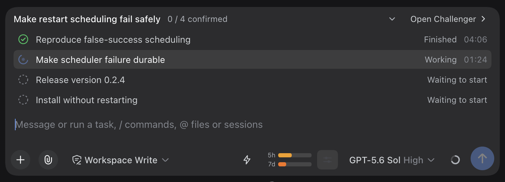
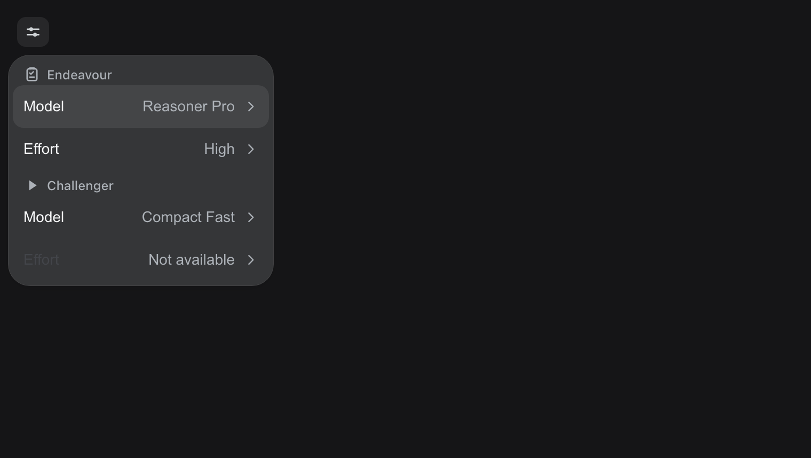
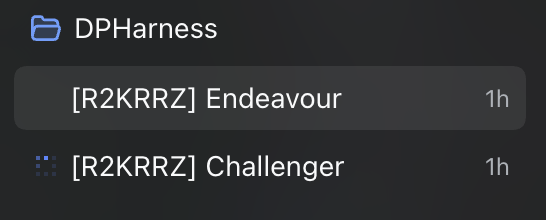
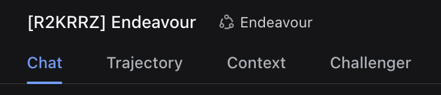

# Orbital Agents

Two coordinated DSH agents that plan and execute as one pair. **Orbital Agents** is the project and
repository identity; the published package is **`dsh-orbital-agents`** (the predecessor name
`dsh-endeavour` is superseded and deprecated on npm).

The **Endeavour** agent investigates, writes the plan, and verifies results. Its persistent
**Challenger** peer is a second ordinary chat that executes the plan and reports back through a
durable protocol. The pair is created once and reused for every later plan, so the two agents stay in
the same orbit instead of being re-spawned per task.

- Target runtime: DeepSeek Harness **v0.1.7-rc.1** (Cordis 4.0.4), the family bundled by the
  third-party community **DSH Desktop v2.0.14**. Harness 0.1.7 replaced directory agent presets with
  composition rows and moved session navigation to the Workspace view owner, so earlier harness
  releases are no longer supported. This is a community integration; it is not an official DeepSeek
  product.
- The global bundle only provides the durable orchestration service. The four model-facing tools are
  registered by the scoped `dsh-orbital-agents/tools` row of the **Endeavour** preset, so the standard
  preset never sees them.
- User-visible task states are exactly four: waiting, running, succeeded, failed — shown as
  `Waiting to start`, `Working`, `Finished`, `Confirmed`, and `Failed` display stages.
- Only Endeavour records success or failure after a quick acceptance check; the Challenger can never
  authorize terminal success.

## Use it

1. Install the package and the user presets (see below), then restart DSH Desktop so the profile
   bundle row and the presets are loaded:
   `osascript -e 'quit app "DSH Desktop"'` then `open "/Applications/DSH Desktop.app"`.
2. Start a **New Chat** and pick the **Endeavour** preset.
3. Choose the planning model normally in the composer (ordinary model selection), and use the
   unified model control — one icon-only button that opens Model/Thinking rows for **Endeavour** and
   **Challenger** separately.
4. Describe the task in ordinary language and send it. This is the only step that needs provider
   credentials.
5. Watch the plan card in the Endeavour chat: progress, the durable task states, a live timer per
   running task, and the frozen duration after verification. `Open Challenger` opens the paired chat
   that executes the tasks.

Two ordinary presets ship together: **Endeavour** (planner: `endeavour_plan`, `endeavour_verify`)
and **Challenger** (executor: `challenger_start_task`, `challenger_report`). A plan is delivered once
to the persistent Challenger session paired with its Endeavour session; the companion is never a
subagent and is reused by every later plan of that pair. If a user asks for the
Challenger directly, Endeavour uses that paired companion and starts work only
through `endeavour_plan`; it never spawns a native subagent to replace it.

A paired Endeavour session shows a native `Challenger` view tab next to `Chat` and `Trajectory`, and
the Challenger session shows the reciprocal `Endeavour` tab; either tab opens the other ordinary
session of the pair (see [docs/architecture.md](docs/architecture.md)).

## Install

```sh
git clone git@github.com:Qulierm/orbital-agents.git
cd orbital-agents
pnpm install --frozen-lockfile
pnpm run build
pnpm pack
node scripts/install-local.mjs --tarball ./dsh-orbital-agents-0.2.6.tgz
```

The installer backs up the desktop profile and any existing user preset first, installs the package
into `~/.dsh/profiles/desktop`, and preserves existing plugin order. The two agent presets ship inside
the package as bundle patches (`presets/endeavour.patch.yml`, `presets/challenger.patch.yml`), so no
preset directory is written; an upgrade retires the ownership-marked directories earlier releases
installed under `~/.dsh/.agent-presets`. Re-running it is
idempotent; a changed tarball at the same name/version still refreshes the installed artifact
(remove-before-add). See [docs/install.md](docs/install.md) for the full lifecycle.

## npm package

The same source is published to the public npm registry as
[`dsh-orbital-agents`](https://www.npmjs.com/package/dsh-orbital-agents) (MIT), so the released artifact can be
inspected or fetched by version instead of building it locally:

```sh
npm view dsh-orbital-agents version # latest published version
npm pack dsh-orbital-agents@0.2.6   # download exactly the published tarball
node scripts/install-local.mjs --tarball ./dsh-orbital-agents-0.2.6.tgz
```

`npm pack` writes the published tarball into the current directory, and the installer is run from a
clone of this repository with that path — the same installer documented in
[docs/install.md](docs/install.md). Installing the package as a plain library dependency is not a
supported way to load it into DSH Desktop: the plugin is mounted by the desktop profile and its
presets, which is what the installer configures.

## Why two agents

Think of a rendezvous in orbit: one vehicle does the planning and holds the checklist, a second flies
the burn. Neither is a passenger, and neither is a throwaway stage — they stay docked for as long as
the mission lasts.

**Two persistent ordinary sessions, not a subagent system.** Endeavour and Challenger are two regular
chats that are paired once. The Challenger has its own conversation, its own model selection, and its
own history; it is provisioned through the same ordinary session path the UI uses, is never recreated
per plan, and is never spawned as a subagent. What connects them is a durable protocol, not a parent
process: Endeavour sends the whole plan once, the Challenger reports evidence back, and Endeavour
answers with a verdict.

**The split of work.** Endeavour owns requirements analysis, architecture, acceptance criteria and
verification. The Challenger receives the finished plan and executes its bounded, sequential tasks,
reporting for each one a summary, the files it touched, the validation it actually ran, and — when
something goes wrong — a blocker or failure. Endeavour then accepts or rejects each item against the
criteria it wrote. A task is only `Confirmed` after that review; until then it stays `Finished`.
Because the plan constrains the execution, the Challenger's job is usually narrower than the
planner's: follow the decisions, run the checks, report honestly.

**Why that can be economical.** This shape lets you spend differently on the two halves. Put an
expensive, strong-at-reasoning model on Endeavour, where the plan, the constraints and the acceptance
checks are decided, and a faster, lower-cost model on the Challenger, where the work is already
bounded by that plan and every task is verified afterwards. Depending on your provider and pricing,
that division can reduce what a long run costs compared with using the strongest model for everything,
and the two routes are configured independently — see [Model selection](#model-selection). Examples
people use for the two roles, purely as provider-dependent illustration and not as a claim about what
this project supports or what any provider offers:

- premium planning and review routes, in the same class as *Opus 5*, *Fable 5.1*, *GPT 6 Astra* or
  *GPT 5.6 Sol*;
- economical execution routes, in the same class as *DeepSeek 4.1 Flash* or *GPT 5.6 Luna*.

Whatever you choose, decide it in your own provider setup: which models exist, what they cost and how
they behave are properties of your deployment, not of Orbital Agents. Savings are a possible outcome
of the split, not a guarantee, and quality is supported by Endeavour's acceptance criteria and its
review of the Challenger's evidence — not promised by the pairing.

**The panel is the protocol made visible.** Directly above the composer (and as a card in the
transcript) the plan panel shows the run as it happens: how many tasks are confirmed, which task is
current, a live timer on the working row, and the frozen duration afterwards. Its rows are the durable
task states, not decoration — `Waiting to start`, `Working`, `Finished` (reported, awaiting review),
`Confirmed` (accepted after Endeavour's check) and `Failed`. The row colours make the stages readable
at a glance: a gray ring while waiting, a blue animated ring while working, a green check once a task
has been reported, the same check in violet once Endeavour has accepted it, and a red cross on
failure.

**When the Challenger stops, the plan says so.** If the paired Challenger session is no longer
running while the plan still expects execution work — the turn was stopped, it errored, or the
session went away — the row the plan is waiting on switches to `Challenger stopped` with a static
orange circled exclamation, on both the panel above the composer and the transcript card. It covers
stopping before the first task, in the middle of one, and between sequential tasks, and it clears by
itself as soon as the Challenger runs again. This is deliberately *not* a fifth durable task state:
it is live session activity read from the official session list, so nothing about the recorded plan,
its events or the protocol changes. A task that had already started keeps counting its elapsed time
while it waits to be resumed, and opening the Challenger is still a normal chat away.

## Restarting Desktop

DSH Desktop serves this plugin, so quitting it also kills whatever tool call is running inside it.
That makes an in-app restart asymmetric: a manual restart is always safe, while an agent-driven one
must be scheduled before anything is reported.

- **Manual:** quit and reopen DSH Desktop yourself (`osascript -e 'quit app "DSH Desktop"'`, then
  `open "/Applications/DSH Desktop.app"`), or just use the app's own quit. Nothing else is needed.
- **Agent-safe scheduling:** the packaged helper
  `node "$HOME/.dsh/profiles/desktop/node_modules/dsh-orbital-agents/scripts/schedule-desktop-restart.mjs" --delay-seconds 45` validates macOS, writes its log under
  `~/.dsh/backups/endeavour/restarts`, spawns a detached worker and returns **immediately** with a
  schedule id and the log path. The worker waits, quits the app, waits for the old process to leave,
  reopens the bundle and records `ready` or `failed` in that log.
- A restart is the **last** task of a plan. The executor reports `restart scheduled` with the schedule
  id and log path and stops; nobody claims the app came back, because the host that would observe that
  is the one being restarted. Read the log afterwards for the real outcome.
- Never keep a call alive across the restart: no `sleep`, no `tail`, no `ps`/`lsof` polling after the
  quit step. DSH records such a call as interrupted with an unknown outcome and the report is lost.

The `--delay-seconds` floor is 30 seconds, so the report always has time to land before the worker
acts.

## Model selection

The composer carries one unified control: a single icon-only button (id `endeavour-models`) that opens
a menu with an **Endeavour** section and a **Challenger** section, each with its own **Model** and
**Thinking** rows. Both roles are configured from that one menu and stay independent:

- every read, subscription, catalog load and write goes through the official model directory of the
  target session — the Endeavour session the control is rendered in, and its paired Challenger;
- choosing a model writes through that role's directory and resets only that role's thinking effort
  to the model's catalog default;
- the host's native Endeavour selector is hidden by CSS only while the unified control is rendered,
  so Standard and unpaired chats keep their ordinary selector;
- while a plan is active the whole control is disabled, which keeps every route frozen for the run.

A temporary gap in the paired-session projection cannot unmount the control: admission is latched
after the pair is first seen, and the validated Challenger identity is retained, so a role whose
model directory is briefly unavailable shows a local unavailable/retry state instead of a vanished
control. See [docs/configuration.md](docs/configuration.md).

## Lifecycle

- Backups live in `~/.dsh/backups/endeavour/<timestamp>/` (`profile/`, `preset/`, `state.json`).
- `--list-backups` lists them; `--rollback <timestamp>` restores the profile files and preset state
  exactly.
- `--uninstall` removes the plugin, its bundle row, and only a preset this package owns (an existing
  user-authored preset is left untouched).
- Conflicts: an existing non-owned preset is never overwritten; pass `--force` to replace it after
  the automatic backup.
- Installation first runs a read-only legacy-plan preflight over the real session storage: a
  NONTERMINAL `childId`-only plan aborts the install (with the affected session ids and remediation)
  before any mutation; terminal historical plans are allowed and stay readable.

See [docs/install.md](docs/install.md) for the full lifecycle and
[docs/architecture.md](docs/architecture.md) for the invariants.

## Screenshots

These are real captures of a running DSH Desktop session using the plugin — not
offline renders or mock-ups.

### A live plan



The card tracks the plan as it happens: a green check on the row the Challenger
has already reported, the blue animated ring with a live timer on the row it is
working on, and gray rings on the rows still waiting to start.

### The unified model menu



One control configures both ordinary sessions of the pair: the Endeavour section
and the Challenger section each carry their own Model and Effort.

### The paired sessions



The pair lives in the workspace sidebar as two ordinary sessions, labelled with
the shared pair code.

### The Challenger view tab



The session header carries the tab that opens the paired Challenger, so the
executor's own chat is one click away.

### Updating them

The plugin registry reads `screenshots.json` from this repository root, so the
Market card and install dialog pick these images up on the next registry build —
no pull request is needed to change them. To replace one, drop a new PNG at the
same relative path declared in `screenshots.json`.

`scripts/screenshots/` holds an offline harness that renders the plan card and
the model control from the plugin's own components against fixture data; it
writes to `scripts/screenshots/out/` by default and never touches the committed
captures above.

## License

MIT — see [LICENSE](LICENSE).
